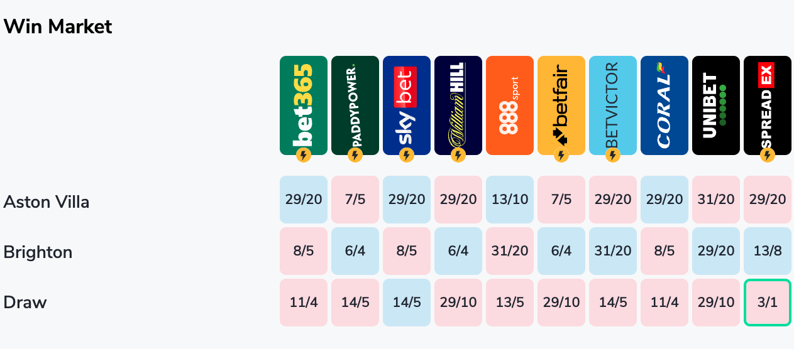
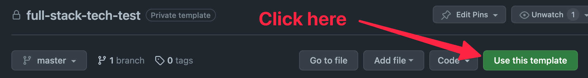
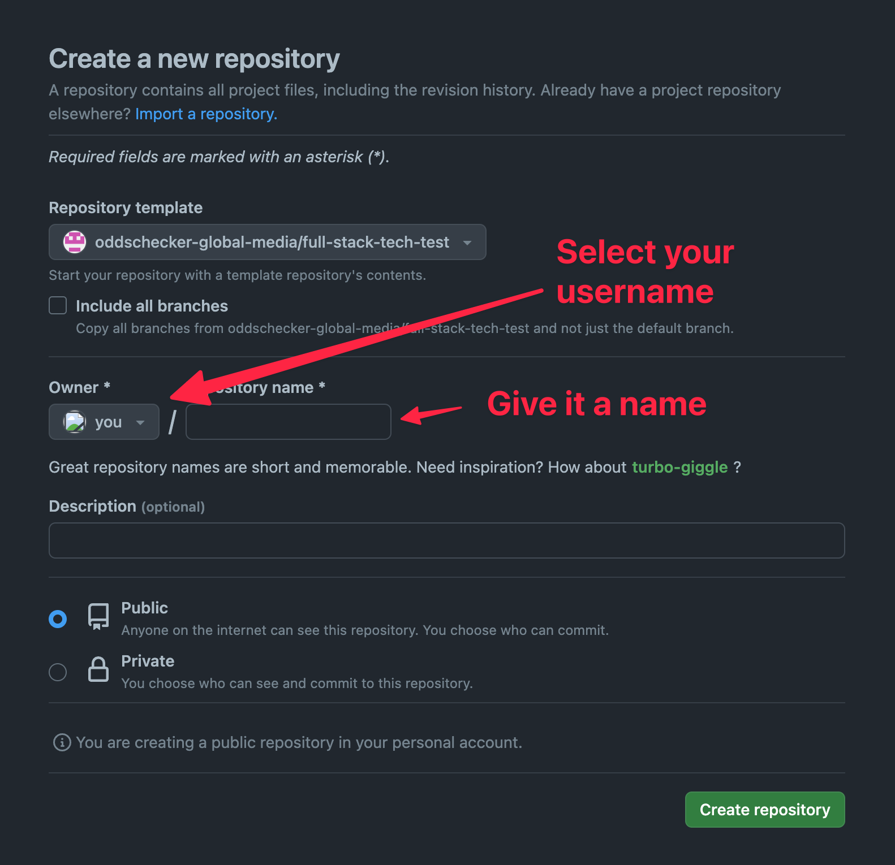

# OGM Full-Stack TypeScript Tech Test

This workspace was generated by [Nx, a Smart, fast and extensible build system.](https://nx.dev)

## Intro

Oddschecker aggregates odds from over 100+ bookmakers worldwide and displays that information in an easily consumable format.

## Task

Using the API provided with this task, we want you to build an e2e application that:

1. Fetches a `Market` (think of this as the odds and metadata for a match market like "Win Market") from the provided [api](https://github.com/oddschecker-global-media/full-stack-tech-test/tree/master/apps/api) endpoint: `(GET)` [http://localhost:3001/api/market](http://localhost:3001/api/market)
2. Displays the `Market` data in an easily consumable grid format similar to what you would see at oddschecker.com:



Note: Bookmaker logo SVGs have been provided in the `public/img` dir of the [frontend](https://github.com/oddschecker-global-media/full-stack-tech-test/tree/master/apps/frontend) application for use.

## What is expected

You have freedom in how you implement the solution, but a few things should appear in the final submission:

- Your solution should run on a single machine as the boilerplate currently does
- The API is not exposed to the public internet - the `Market` data should be fetched via proxy (hint: [Remix Resource Routes](https://remix.run/docs/en/main/guides/resource-routes))
- The UI should be provided in entirely type-safe React (no `any` please!)
- Modern CSS is what we're looking for (`flex`/`grid`) and fully responsive
- Include any tests you deem important in regards to the frontend

Please note: we don't expect you to spend a long time on your submission, in fact we'd like you to spend no more than 2 hours on this task. Complete what you deem to be the most important aspects of this solution and please update the `SOLUTION.md` file with information on what you'd likely do next, given more time.

## What isn't expected

- You do not need to make any changes to the [api](https://github.com/oddschecker-global-media/full-stack-tech-test/tree/master/apps/api) application

## Getting started

1. Click the "Use this template" button in the header of the Github repository:



2. Choose your username from the list and give the repository a name:



3. Clone your new repository

4. Ensure you have [pnpm](https://pnpm.io/) installed

5. Run `pnpm install`

You're now ready to run the project locally!

## Running the project locally

### Running the frontend

To serve the [frontend](https://github.com/oddschecker-global-media/full-stack-tech-test/tree/master/apps/frontend) at [http://localhost:3000](http://localhost:3000):

```sh
nx run frontend:serve
```

### Running the API

To serve the [api](https://github.com/oddschecker-global-media/full-stack-tech-test/tree/master/apps/api) at [http://localhost:3001](http://localhost:3001)

```sh
nx run api:serve
```

You can now use something like `curl` or Postman to make `GET` requests to [http://localhost:3001/api/market](http://localhost:3001/api/market) and receive a `Market` in JSON format.

### Running both at once:

To serve both application at once in a single terminal window:

```sh
nx run-many -t serve
```

Note: If you find that `nx` commands don't work as above there is likely something wrong with your `PATH` and it's not looking for binaries in the `node_modules/.bin` dir. You can try running `pnpm run nx <rest of command>` as a backup option.

## Submitting your test

Please submit the final Github repository URL.

Note: If you have set the repository to "Private" you will need to provide us with access to review your work.
